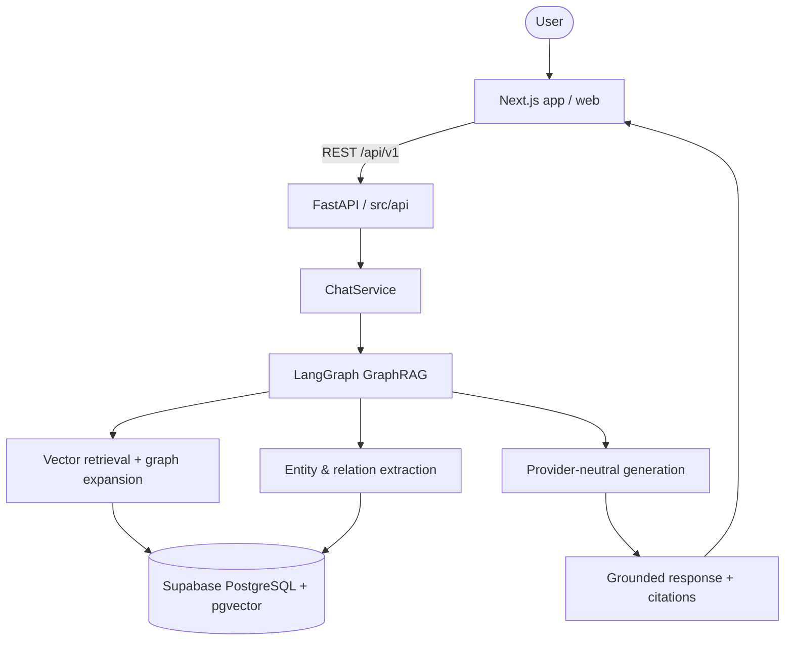
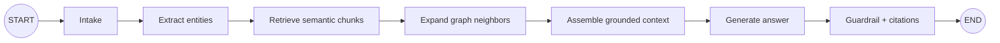

# MediPay Agent Architecture

## System Overview

MediPay Agent dùng FastAPI backend trong `src`, LangGraph để điều phối GraphRAG, và Supabase PostgreSQL với `pgvector` để lưu dữ liệu nghiệp vụ, chunks, embeddings, entities và relations. Docker local chỉ chạy backend; frontend Next.js sẽ đặt tại `web/` ở giai đoạn tiếp theo. LLM và embedding provider để dạng adapter/interface vì team chưa chốt model local.

## Architecture Diagram



## Repository Boundaries

```text
src/
├── main.py
├── config.py
├── api/              # HTTP validation, dependencies, error mapping
├── agents/           # LangGraph state, nodes and tools
├── db/               # SQLAlchemy async session, models, repositories
├── graph_rag/        # chunking, extraction, retrieval, ingestion
├── integrations/     # LLM/embedding protocols and telemetry adapters
├── models/           # Pydantic API and graph DTOs
└── services/         # application use cases
web/                  # Next.js frontend, future scope
supabase/migrations/  # SQL schema managed by Supabase
```

Routes do not execute SQL, call LLMs, build prompts, or orchestrate graph nodes directly. Services own use cases. Repositories own DB queries. Graph nodes own workflow steps.

## GraphRAG Flow



Query path:

1. Validate query in API with Pydantic.
2. Extract query entities through provider-neutral graph extractor.
3. Embed query when embedding adapter is configured.
4. Search `document_chunks.embedding` using pgvector.
5. Traverse bounded `relations` around matched entities.
6. Merge chunks, graph facts and provenance into context.
7. Generate answer through selected local model adapter.
8. Return answer and citations; never return chain-of-thought.

Ingestion path:

```text
Document → chunk → optional embedding → entity/relation extraction
→ documents/document_chunks/entities/relations in Supabase
```

## Components

### Frontend: `web/`

Next.js App Router frontend. `app/` owns pages/layout; `components/` owns UI; `lib/` owns typed FastAPI client and environment helpers. Frontend implementation is outside current backend GraphRAG scope.

### Backend: `src/`

- `src/api`: REST endpoints `/health`, `/api/v1/chat`, `/api/v1/status`; request validation and safe error mapping.
- `src/services`: chat and GraphRAG application use cases.
- `src/agents`: LangGraph workflow and typed `AgentState`.
- `src/graph_rag`: chunking, extraction contracts, retrieval and ingestion logic.
- `src/integrations`: provider-neutral LLM/embedding protocols; model runtime remains unselected.
- `src/db`: SQLAlchemy async engine, models and repositories.
- `src/config.py`: environment settings, pool, retrieval and chunk parameters.

### Database: Supabase PostgreSQL

Supabase is selected for shared PostgreSQL and `pgvector`. Current schema script defines:

- `documents`: source metadata and content hash.
- `document_chunks`: chunk text, source and nullable vector embedding.
- `entities`: extracted graph nodes.
- `relations`: directed graph edges between entities.
- `conversations`, `messages`: chat history.

Schema lives in `supabase/migrations/0001_initial_graphrag.sql` and runs through Supabase SQL Editor/CLI. No Alembic folder.

Embedding vector dimension remains uncommitted until local embedding model selection. Migration keeps embedding column flexible; add dimension-specific index after model decision and reindex existing chunks.

### LLM and embeddings

`src/integrations/llm.py` and `src/integrations/embeddings.py` expose protocols and safe unconfigured adapters. No OpenAI, Ollama, llama.cpp or other local runtime is selected yet. Missing configuration returns explicit setup error instead of silently calling external API.

## Docker Local

`docker-compose.yml` runs only `backend` and loads Supabase connection settings from `.env`. PostgreSQL does not run in local compose; backend connects to Supabase using `DATABASE_URL` and must use Supabase hostname, not `localhost` inside container.

```bash
cp .env.example .env
# Fill DATABASE_URL and SUPABASE_URL.
docker compose up --build
```

Production deployment, Vercel setup and CI/CD expansion are outside this change.

## Security

- Keep `.env` out of Git.
- Use Supabase secret/database URL only in server environment.
- Keep CORS allowlist explicit.
- Validate payloads with Pydantic.
- Return generic internal errors from API; log details server-side.
- Apply Supabase RLS policies before exposing user/document data.
- Avoid storing unnecessary patient-identifying data and never expose chain-of-thought.
- Rotate any credential that was previously committed in example files.

## Design Decisions

| Decision | Choice | Reason |
|---|---|---|
| Backend | FastAPI + Python 3.11 | Existing scaffold, async API and typing |
| Agent | LangGraph | Explicit stateful GraphRAG workflow |
| Database | Supabase PostgreSQL | Shared managed DB, SQL and auth/storage ecosystem |
| Vector search | PostgreSQL `pgvector` | Vector and graph facts share one data boundary |
| Graph store | PostgreSQL entity/relation tables | No second graph database before scale requires it |
| Frontend | Next.js under `web/` | Keeps Python backend `src` boundary clean |
| LLM/embedding | Provider-neutral interfaces | Local model runtime not selected yet |
| Schema migration | Supabase SQL migrations | Matches managed Supabase workflow; no Alembic |
