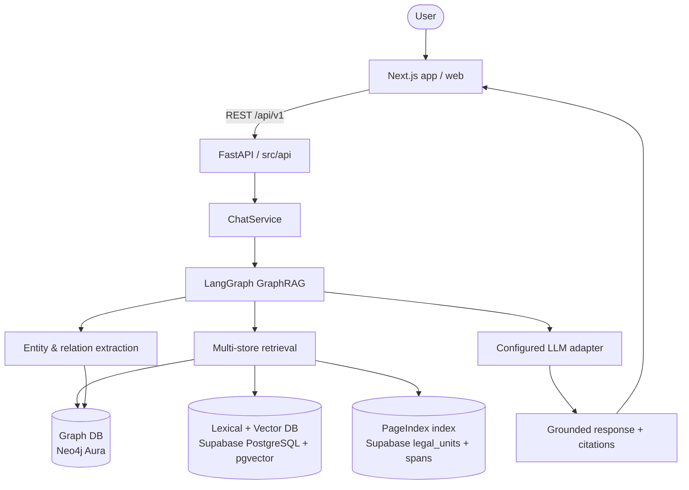
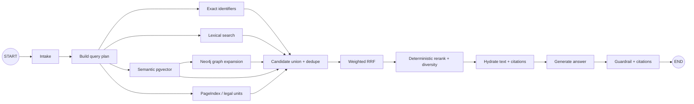

# MediPay Agent Architecture

## System Overview

MediPay Agent dùng FastAPI backend trong `src`, LangGraph để điều phối GraphRAG,
Supabase PostgreSQL cho documents/chunks, PageIndex/legal units, lexical search
và pgvector semantic search; Neo4j giữ knowledge graph. PageIndex, lexical và
vector là các index logic trong cùng Supabase database, không phải database vật
lý tách rời. Embedding dùng OpenAI `text-embedding-3-small` (1536 chiều).
Firebase là scaffold đăng nhập cho frontend Next.js.

## Architecture Diagram



## Repository Boundaries

```text
src/
├── main.py
├── config.py
├── api/              # HTTP validation, dependencies, error mapping
├── agents/           # LangGraph state, nodes and tools
├── db/               # SQLAlchemy async session, models, repositories
├── graph_rag/        # chunking, extraction, retrieval, ingestion
├── integrations/     # LLM/embedding protocols and telemetry adapters
├── models/           # Pydantic API and graph DTOs
└── services/         # application use cases
web/                  # Next.js frontend, future scope
database/             # PostgreSQL, pipeline, Neo4j and Firebase
├── neo4j/            # Knowledge graph store and importer
└── firebase/         # Firebase Authentication scaffold
```

Routes do not execute SQL, call LLMs, build prompts, or orchestrate graph nodes directly. Services own use cases. Repositories own DB queries. Graph nodes own workflow steps.

## GraphRAG Flow



Query path:

1. Validate query in API with Pydantic.
2. Build a plan from identifiers, legal labels, date and jurisdiction.
3. Run exact, PostgreSQL lexical and pgvector semantic retrieval.
4. Use `legal_units`/PageIndex metadata to preserve hierarchy and citation spans.
5. Seed bounded Neo4j traversal with matched document IDs and keep edge predicates.
6. Fuse candidates with RRF while preserving channel, score and provenance.
7. Fetch quoted text from Supabase chunks/legal units and generate a cited answer.
8. Return answer and citations; never return chain-of-thought.

Ingestion path:

```text
Document → chunk → OpenAI embedding → document/chunk release in Supabase
Document relationship CSV → typed relationships in Neo4j
```

### GraphRAG retrieval and reranking model

There are two physical stores and three retrieval indexes. Supabase PostgreSQL
contains the lexical, vector and PageIndex indexes; Neo4j Aura contains the
directed graph:

| Store | Current implementation | Returns |
|---|---|---|
| Lexical + vector DB | `chunks.search_vector`, `chunks.embedding` | ranked chunk candidates |
| PageIndex index | `legal_units` and PageIndex artifacts in Supabase | hierarchy, labels, spans and chunk mapping |
| Graph DB | Neo4j Aura | document IDs, typed predicates and bounded paths |

The request path is:

1. Normalize the query and extract document number, legal label, category,
   date and jurisdiction.
2. Run lexical and vector search in parallel using the active dataset. Query
   embedding uses the same `text-embedding-3-small`/1536-dimensional contract.
3. Query PageIndex by document/unit hints and expand only relevant ancestors,
   descendants or siblings; never retrieve an entire tree by default.
4. Use document IDs from lexical, vector and PageIndex as Neo4j seeds. Traverse
   typed edges with maximum hops and neighbor limits.
5. Union candidates by `dataset_id + chunk_id`, deduplicate, and retain every
   channel rank, raw score, graph path and PageIndex span.
6. Apply weighted RRF: `sum(weight[channel] / (60 + rank[channel]))`.
   Start with exact 2.0, PageIndex 1.25, lexical 1.0, semantic 1.0 and graph
   0.75; tune these values on an evaluation set.
7. Rerank only the candidate set using exact identifier/label match, same legal
   unit, active-version validity and graph-path relevance. Apply a document/unit
   diversity cap so one source cannot fill the entire context.
8. Hydrate final passages from Supabase chunks and PageIndex/legal_units, then
   assemble source-ordered context and citations. Graph edges are context,
   never quoted legal text.

The graph adapter should expose `expand(seed_document_ids)` and the read
repository should expose `get_evidence(chunk_ids)`. This keeps Neo4j focused on
navigation and Supabase authoritative for text, hashes and release consistency.
Every evidence item carries `dataset_version`, `document_id`,
`chunk_id`/`passage_id`, `unit_id`, source offsets, channels, raw scores, fused
score and (when applicable) graph path.

## Components

### Frontend: `web/`

Next.js App Router frontend. `app/` owns pages/layout; `components/` owns UI; `lib/` owns typed FastAPI client and environment helpers. Frontend implementation is outside current backend GraphRAG scope.

### Backend: `src/`

- `src/api`: REST endpoints `/health`, `/api/v1/chat`, `/api/v1/status`; request validation and safe error mapping.
- `src/services`: chat and GraphRAG application use cases.
- `src/agents`: LangGraph workflow and typed `AgentState`.
- `src/graph_rag`: chunking, extraction contracts, retrieval and ingestion logic.
- `src/integrations`: OpenAI embedding adapter and Neo4j graph adapter.
- `src/db`: SQLAlchemy async engine, models and repositories.
- `src/config.py`: environment settings, pool, retrieval and chunk parameters.

### Database: Supabase PostgreSQL

Supabase is selected for shared PostgreSQL and `pgvector`. Current schema script defines:

- `documents`: source metadata and content hash.
- `chunks`: release-scoped chunk text, provenance, lexical vector and embedding.
- `legal_units`, `document_tables`, `table_cells`: citation and source structure.

Schema lives in `database/schema.sql` and runs through Supabase SQL Editor/CLI. Neo4j owns entity/relation graph data; no graph tables are created in PostgreSQL.

Embedding uses OpenAI `text-embedding-3-small` with 1536 dimensions. Existing vectors must be rebuilt after this migration.

### LLM and embeddings

`src/integrations/embeddings.py` calls OpenAI only when `OPENAI_API_KEY` is
configured. Graph traversal uses Neo4j when `NEO4J_URI` and
`NEO4J_PASSWORD` are configured.

## Docker Local

`docker-compose.yml` runs only `backend` and loads Supabase connection settings from `.env`. PostgreSQL does not run in local compose; backend connects to Supabase using `DATABASE_URL` and must use Supabase hostname, not `localhost` inside container.

```bash
cp .env.example .env
# Fill DATABASE_URL and SUPABASE_URL.
docker compose up --build
```

Production deployment, Vercel setup and CI/CD expansion are outside this change.

## Security

- Keep `.env` out of Git.
- Use Supabase secret/database URL only in server environment.
- Keep CORS allowlist explicit.
- Validate payloads with Pydantic.
- Return generic internal errors from API; log details server-side.
- Apply Supabase RLS policies before exposing user/document data.
- Avoid storing unnecessary patient-identifying data and never expose chain-of-thought.
- Rotate any credential that was previously committed in example files.

## Design Decisions

| Decision | Choice | Reason |
|---|---|---|
| Backend | FastAPI + Python 3.11 | Existing scaffold, async API and typing |
| Agent | LangGraph | Explicit stateful GraphRAG workflow |
| Database | Supabase PostgreSQL | Shared managed DB, SQL and auth/storage ecosystem |
| Vector search | PostgreSQL `pgvector` | Vector and graph facts share one data boundary |
| Graph store | Neo4j | Native directed graph traversal and Aura deployment |
| Frontend | Next.js under `web/` | Keeps Python backend `src` boundary clean |
| LLM/embedding | OpenAI embeddings + existing LLM adapter | `text-embedding-3-small`, 1536 dimensions |
| Schema migration | Supabase SQL migrations | Matches managed Supabase workflow; no Alembic |
