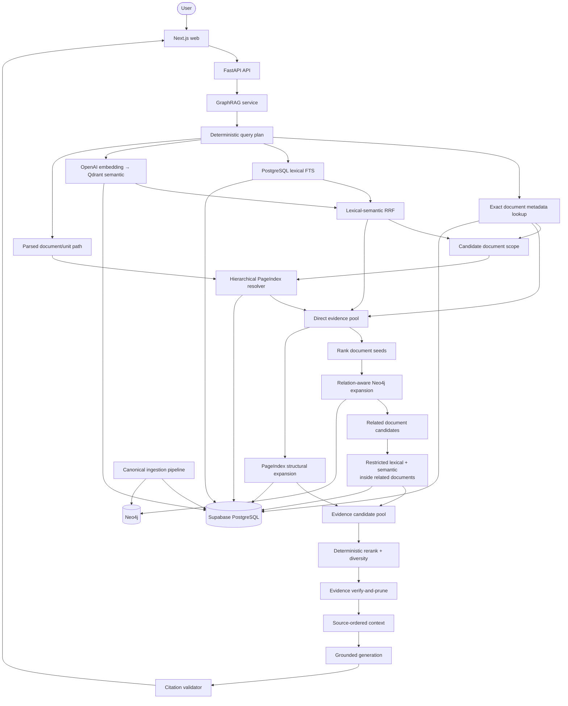
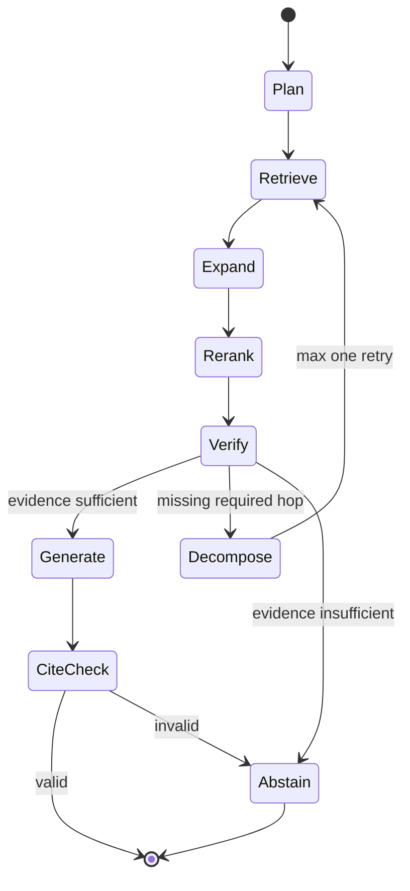

# MediPay Agent — Evidence-first GraphRAG Architecture

## 1. Mức độ chắc chắn và quyết định cốt lõi

Không có kiến trúc GraphRAG nào đúng “100%” trước khi được đo trên tập câu hỏi
thật của team. Tài liệu này vì vậy phân biệt rõ:

- **contract bắt buộc** để bảo đảm đúng dữ liệu, đúng release và đúng citation;
- **baseline khuyến nghị** để triển khai ngay;
- **tham số cần tune** bằng evaluation thay vì coi là hằng số tối ưu.

Với database hiện có, kiến trúc phù hợp nhất là:

> **Seed → Expand → Re-retrieve → Verify**

1. **Seed:** exact/lexical tìm trong Supabase; semantic tìm Qdrant rồi hydrate passage chuẩn từ Supabase.
2. **Expand:** PageIndex mở ngữ cảnh Điều–Khoản–Điểm; Neo4j mở văn bản liên
   quan theo predicate có hướng.
3. **Re-retrieve:** với mỗi document do graph tìm được, tìm lại passage phù hợp
   bên trong document đó; không đưa graph label vào answer như evidence.
4. **Verify:** rerank, kiểm tra hiệu lực/provenance, chọn evidence và xác thực
   citation trước khi sinh câu trả lời.

Chỉ dùng ba lớp retrieval đã có; lớp hybrid gồm hai tín hiệu lexical và
semantic:

| Lớp | Nguồn hiện có | Nhiệm vụ duy nhất |
|---|---|---|
| Hybrid recall | exact/lexical: Supabase; semantic: Qdrant alias `medical_legal_active` | tìm passage trực tiếp bằng exact/keyword và gần nghĩa |
| PageIndex | `legal_units` và cột `chunks.unit_id`/source offsets | resolve/expand cấu trúc và citation span |
| Graph | Neo4j `Document` + relationship có hướng | tìm văn bản liên quan và reasoning path |

Không xây thêm ontology graph, fact graph, memory graph hoặc community graph.

## 2. Những gì thực sự học từ các GraphRAG tham khảo

| Hệ thống | Retrieval thực tế | Áp dụng cho MediPay |
|---|---|---|
| LegalGraphRAG | hợp nhất nhiều retrieval strategy song song, sau đó Auditor verify-and-prune trước khi tổng hợp | lexical/semantic/PageIndex/graph tạo candidate; một evidence verifier loại hit không đủ căn cứ trước generation |
| MemGraphRAG | semantic relevance khởi tạo query-specific node weights; graph propagation/PPR đưa score trở lại passage; dense retrieval là fallback | dùng direct passage score làm graph seed; propagation có restart/hop decay; kết quả cuối luôn quay lại passage |
| Youtu-GraphRAG | entity, relation, keyword và path retrieval chạy song song; complex query được tách thành atomic sub-query và có reflection | map entity/keyword vào lexical, direct chunk vào semantic, path vào Neo4j; chỉ decomposition khi query thật sự multi-hop |
| OMD-GraphRAG | factoid ưu tiên entity/graph, thematic ưu tiên semantic/global channel; fuse rồi rerank | route nhẹ theo query shape: identifier/relationship ưu tiên lexical+graph, thematic ưu tiên semantic+PageIndex |

Các kỹ thuật không được mang sang vì không có data contract tương ứng:

- community detection và community summaries;
- OpenIE/LLM-generated entity/fact graph;
- graph traversal không giới hạn;
- LLM router cho mọi request;
- trả lời trực tiếp từ node/edge text không có source passage.

## 3. Hiện trạng repository: implemented và target

`database/postgres/schema.sql` cùng `database/pipeline/data_pipeline` là data contract
chuẩn. Runtime production dùng `src/services/chat.py` + `src/db/repositories.py`;
`src/graph_rag` là scaffold cũ, không phải request path.

| Khả năng | Hiện trạng trong code | Trạng thái kiến trúc |
|---|---|---|
| Versioned dataset, active views, hashes | active: `snapshot-c439751724ab7f10` | đã cutover; giữ immutable release contract |
| Legal-unit-aware chunks và PageIndex tree | 28.285 units / 37.170 passages active | Điều/Khoản exact resolve đã online |
| Lexical search | đã có, chỉ index `chunks.text` | cần exact-hint query và field boost |
| Semantic Qdrant | 14.393 vector, 1.536 chiều, ID/hash parity qua alias active | online; corpus không lưu pgvector |
| RRF | weighted RRF + max 2 evidence/document | cần tune bằng held-out eval |
| Neo4j import | active graph: 1.901 nodes, 5.810 legal edges + 7 aliases; old releases đã xóa sau backup | parity với active PostgreSQL dataset ID |
| Neo4j online expansion | chỉ temporal/relational, `approved_evidence`, re-retrieve lexical/Qdrant | production live; graph outage degrade an toàn |
| PageIndex online resolve/expand | exact Điều/Khoản scoped by matched document | ancestor/child expansion còn cần eval |
| Evidence rerank/verification | weighted RRF, diversity, local text hash và Qdrant input-hash precheck | LLM verifier chỉ dành high-risk |
| `src/db` production repository | release-scoped Supabase hydration, exact/lexical/PageIndex | production path |
| Release read isolation | base-table `public_read` hiện là `USING (true)` | app role chỉ được thấy active release/view |

Do đó các sơ đồ bên dưới chủ yếu là **target architecture**; implementation
online hiện đã có Qdrant, deterministic metadata route, PageIndex exact resolve
và graph re-retrieval, còn rerank/verifier nâng cao phải được đo bằng eval mới.

### Data readiness audit và baseline production cutover — 2026-08-13

Dữ liệu không được gọi là “hoàn hảo”: trạng thái pháp lý chỉ được kết luận khi
có nguồn chính thức; graph-derived status luôn là candidate. Release production
hiện tại được dựng tại `data/clean/medical_active_v12_final`:

| Gate | Kết quả |
|---|---:|
| Input document union | 690 |
| Canonical documents sau alias collapse | 683 |
| Content HTML không rỗng | 683 / 683 |
| Web recovery qua identity gates | 4 |
| Source record bị loại nhưng giữ alias | `143848 → 157394` |
| Alias legal identity | 7 |
| Legal relationships sau evidence enrichment/dedup | 5.810 |
| Reference-only graph nodes | 1.211 |
| Core / broad-KCB / graph-context | 432 / 165 / 86 |
| Answer-ready cho current-law claim | 294 |
| Tavily canonical backlog đã audit | 414 tasks |
| Tavily canonical requests thành công / lỗi rate-limit còn ghi nhận | 261 / 153 |
| Official target references bổ sung qua Tavily | 79 |
| Strict model-grounded canonical edges | 47 |
| Grounded edges resolve sang legacy references | 51 |
| Grounded edges có official target bổ sung | 97 |
| Temporal status candidate (không ghi đè official status) | 52 edges / 43 documents |
| Encoding warning | 4 |
| Edge chỉ có provenance từ active export | 2.892 |
| Synthetic release benchmark | exact 100/100; graph evidence 100/100; semantic Recall@10 82,5% |

Toàn bộ 689 giá trị `content_text` trong active JSON bị bỏ; 427 dòng sai không
phải do lệch thứ tự ghép row mà do projection đã bị gán sai document. Text của
release mới luôn được sinh lại từ HTML đã chọn. Bốn source HTML thiếu/hỏng được
phục hồi với URL, retrieval time và SHA-256; nguồn HTML bên thứ ba chỉ được nhận
sau khi số/ký hiệu, cơ quan, năm ban hành và title khớp nguồn chính thức.

Canonical gate hiện pass với 683 content, 5.810 edges, 28.301 legal units và
37.288 retrieval passages. Chỉ 14.406 prose passages được embed mặc định;
12.534 table-row passages dùng lexical/structured retrieval để tránh tốn vector
cho các giá trị số gần nhau. Còn hai warning không chặn release: 4 table có CSS
selector + raw-fragment hash chính xác nhưng normalized-text offset chỉ về parent,
và 6 passage dưới 20 ký tự. Chi tiết máy đọc nằm ở
`data/clean/medical_active_v12_final/canonical_validation.json`. Benchmark là
synthetic grounded regression set, chưa phải gold set được chuyên gia pháp lý
adjudicate; không được dùng con số đó để tuyên bố độ chính xác pháp lý tuyệt đối.

### Serving-quality hotfix sau cutover — 2026-08-13

Sau khi bật graph runtime, một test thực tế phát hiện collision nguy hiểm: quyết
định Cà Mau bãi bỏ một quyết định `25/2015/QĐ-UBND` có thể bị nối nhầm với
document cùng số ở Ninh Thuận. Vì vậy toàn bộ 5.810 cạnh vẫn được giữ trong
Neo4j cho audit, nhưng API chỉ phục vụ cạnh có evidence và target resolution
đủ chặt:

| Gate graph runtime | Kết quả |
|---|---:|
| Cạnh legal vẫn giữ cho audit | 5.810 |
| Cạnh được phép online expansion/API quan hệ | 187 |
| Cạnh legacy không có grounded evidence (audit-only) | 5.616 |
| Cạnh model evidence bị chặn do target signature mơ hồ | 4 |
| Cạnh bị chặn do địa phương trong quote mâu thuẫn target | 3 |
| Temporal candidate sau gate (không ghi đè official status) | 45 edges / 37 documents |
| Document có `legal_status_verified=true` | 314 / 683 |

Gate canonical signature không tự động được tin nếu quote nêu địa phương/cơ
quan khác target. Ví dụ Cà Mau → Ninh Thuận hiện bị chặn cả ở `graph_expand`
và endpoint relationships. Ngoài ra, retry Tavily bằng key mới đã tiêu 151
credit, trả về 151 response và chỉ còn 2 network timeout; một official status
cho `58187` được xác nhận “Hết hiệu lực” từ Công báo. Source audit của hotfix
là `data/clean/medical_active_v22_production_hotfix_source`; runtime hotfix chỉ
thay metadata status và các property graph phục vụ, không re-embed hay nhân đôi
release trong Supabase Free.

## 4. System architecture



### Store boundaries

| Store | Dữ liệu | Quyền quyết định |
|---|---|---|
| Supabase PostgreSQL | datasets, canonical documents, aliases, raw HTML, chunks, legal units, tables/cells, lexical indexes | source text, metadata, identity resolution, release và citation; không lưu graph relationships/reference-only stubs |
| Qdrant | versioned cosine vector collection, payload indexes, stable active alias | derived semantic recall only; no canonical text |
| Neo4j | release-scoped canonical/reference/alias `Document` nodes và relationships từ `relationships.csv` | navigation/path giữa documents, không phải source text |
| LangGraph state | query plan, candidates, evidence, warnings | request-scoped orchestration, không phải database |

Graph candidate chỉ là một `document_id + path`. Nó chỉ trở thành **content
evidence** sau khi passage/unit/table tương ứng được hydrate từ Supabase trong
cùng `dataset_id`. Raw graph edge được dùng riêng để chứng minh claim hẹp
“dataset ghi nhận A có quan hệ X với B”; nó không được trích như điều luật hoặc
tự chứng minh hiệu lực. Tương tự, exact document match tạo scope/metadata
evidence, không được gán tùy tiện chunk đầu tiên làm evidence.

## 5. Release-safe ingestion

Target publish flow trên database đủ dung lượng:

```text
curated CSV + active JSON membership + reviewed web recovery
  → reconciled authority CSV + aliases + provenance + explicit crawl backlog
  → canonical snapshot + fingerprint
  → legal_units + tables + legal-unit-aware chunks
  → stage PostgreSQL release
  → build lexical index + embeddings + HNSW
  → import Neo4j với cùng dataset_id
  → validate PostgreSQL/Neo4j edge parity và provenance
  → activate dataset_state.active_dataset_id
```

Supabase và Neo4j không có distributed transaction. Supabase `dataset_state`
là control plane duy nhất; request graph luôn phải filter đúng active
`dataset_id`. Readiness chỉ đạt khi cả hai store có cùng release.

Parity ở đây không có nghĩa mọi Neo4j node phải thành PostgreSQL row. Supabase
chỉ giữ 683 canonical documents và 7 alias mappings; 1.132 reference-only
endpoints sống ở Neo4j cho đến khi có metadata/content thật. Gate activation
phải chứng minh: edge count/type/direction/adverse flag khớp manifest; mọi
endpoint ở Neo4j là canonical, alias hoặc `reference_only`; mọi `graph_id` có
dạng `dataset_id:document_id`; và không có cross-release edge.

`embed_dataset.py` và artifact loader mặc định chỉ embed/load rồi giữ trạng thái
`staging`; cờ `--publish` chỉ được dùng sau khi Neo4j parity gate đã pass. Nếu
Neo4j tạm unavailable:

- direct/structural query có thể degraded sang lexical + semantic + PageIndex
  kèm warning;
- query hỏi quan hệ, sửa đổi, thay thế, bãi bỏ hoặc chuỗi hiệu lực phải fail
  closed nếu graph là evidence bắt buộc.

### Supabase Free deployment profile

Cutover Free ngày 2026-08-13 đã backup release cũ ra local, xóa release
`snapshot-0a74fbdbc635cd71` và HNSW tương ứng, rồi `VACUUM FULL`. Database giảm
từ 494.242.963 xuống 13.069.459 bytes trước ingest. Release mới
`snapshot-c94d7b75195a67fa` hiện active với 683 documents, 37.288 chunks và
14.406 embeddings; `pg_database_size` sau publish là 442.772.627 bytes, còn
81.515.373 bytes dưới quota 500 MiB. PostgreSQL chỉ còn một dataset release.

Khoảng trống này không đủ để giữ đồng thời old active + new staging release.
Vì vậy có hai profile tách biệt:

1. **Paid/đủ dung lượng:** dùng immutable dual-release flow phía trên, zero
   downtime rồi prune superseded release sau retention window.
2. **Free:** build + validate + embed artifact offline; backup release hiện tại;
   maintenance window; xoá old release để cascade-reclaim data/index; ingest
   candidate; import/validate Neo4j cùng dataset ID; cuối cùng activate traffic.

Không được bắt đầu staging trên Free nếu capacity preflight chưa chứng minh đủ
chỗ cho text, table cells, vectors và HNSW. Nếu yêu cầu rollback tức thời/zero
downtime thì phải nâng quota; không thể vừa giữ hai full releases vừa bảo đảm
500 MiB bằng cách “tối ưu SQL” đơn thuần.

## 6. Query plan

Planner mặc định là deterministic và không gọi LLM. Output tối thiểu:

```text
normalized_query
intent: lookup | provision | eligibility | thematic | temporal | relational | table
document_numbers[]
document_titles[]
legal_path[]: ordered Điều → Khoản → Điểm/Phụ lục references
relationship_hints[]
reference_date
category
jurisdiction
requires_decomposition
```

Quy tắc quan trọng:

1. Extract identifier như `111/2024/NQ-HĐND` khỏi cả câu hỏi rồi query đúng
   field `so_ky_hieu`. Không dùng toàn bộ câu tự nhiên làm một chuỗi `ILIKE`.
2. `Điều 3` không đủ unique trên toàn corpus; `Khoản 1` còn không unique trong
   một document. Chỉ resolve sau khi có document scope và đi lần lượt theo
   đường dẫn cha–con đã parse. Surface form `điểm a khoản 1 Điều 3` cũng phải
   canonicalize thành `Điều 3 → Khoản 1 → Điểm a`.
3. Category/jurisdiction explicit có thể là hard filter. `reference_date` và
   status tạo validity state `valid | invalid | unknown`; không hard-filter mù
   vì query temporal cần giữ cả văn bản cũ, sửa đổi và adverse edges.
4. Relationship words như “căn cứ”, “dẫn chiếu”, “sửa đổi”, “thay thế”, “bãi
   bỏ”, “hướng dẫn” map vào allowlist predicate của Neo4j.
5. Chỉ gọi decomposition khi có comparison, từ hai document/entity trở lên,
   một chuỗi relationship, hoặc vòng retrieval đầu thiếu mắt xích rõ ràng.

## 7. Retrieval algorithm

### 7.1 Stage A — Direct recall song song

Chạy đồng thời:

#### Structured exact lookup — thuộc lexical layer

- exact match trên parsed `so_ky_hieu`/document ID;
- normalized title match trên hint đã parse, không match nguyên câu hỏi;
- legal path chuyển cho PageIndex sau khi có document scope;
- explicit category/jurisdiction filters áp dụng lên document candidate;
  status/date được route theo intent và giữ `unknown` thay vì loại sớm.

Exact document hit trả `DocumentCandidate`, không trả chunk đầu tiên. Nó được
dùng để filter/boost passage retrieval, seed graph, hoặc hydrate allowlisted
document metadata cho query hỏi số hiệu/ngày/hiệu lực.

#### Lexical FTS

- query `chunks.search_vector` bằng content keywords đã bỏ question boilerplate;
- explicit category/jurisdiction filter từ document metadata; validity là
  rerank/verification feature;
- strict phrase/AND trước, bounded OR fallback khi thiếu recall.

Exact là nhánh ưu tiên của lexical family, không phải store thứ năm. Lexical
index nên giữ `simple` configuration cho tiếng Việt. `so_ky_hieu` và document
title đi qua exact/metadata branch; FTS dùng weighted vector với unit
label/`section_title` cao hơn body text. Không dùng một `plainto_tsquery` chứa
toàn bộ câu tự nhiên vì AND tất cả token dễ làm recall về 0. Nếu eval có nhiều
query không dấu, bổ sung `unaccent` representation trong chính lexical branch,
không tạo search service mới.

#### Semantic

- query embedding phải cùng model/dimensions/preprocessor với corpus;
- corpus input tiếp tục là `section_title + chunk.text`;
- filter `dataset_id` và `answer_ready` ngay trong Qdrant payload; khi cần
  re-retrieve graph document thì filter thêm `document_id`;
- không trộn cosine score trực tiếp với `ts_rank_cd` vì hai thang điểm khác nhau.

Baseline candidate budget để bắt đầu benchmark:

| Nhánh | Recall budget ban đầu |
|---|---:|
| exact document/unit hints | tất cả exact hit hợp lệ, cap 10 |
| lexical FTS | top 40 |
| semantic | top 40 valid hits; internal candidates ≥5× khi filter mạnh |
| direct union | cap 60 sau dedupe |

Các con số này là baseline, phải tune trên Recall@K và latency.

### 7.2 Stage B — Direct fusion

Lexical FTS và semantic là hai passage ranked-list generators độc lập. Fuse
chúng bằng weighted Reciprocal Rank Fusion:

```text
S_direct(e | q) = Σ[c ∈ {lexical_fts, semantic}] w_c(q) / (k_RRF + rank_c(e))
```

Baseline `k_RRF = 60`. Query-aware weights chỉ thay đổi theo tín hiệu quan sát
được:

- có exact document/unit hint: lexical cao hơn semantic;
- thematic không có identifier: lexical và semantic cân bằng;
- query rất ngắn/không rõ: semantic không được độc quyền context;
- query temporal/relational: direct fusion chỉ tạo seed, graph quyết định
  candidate bổ sung.

Direct evidence pool được tạo như sau:

```text
DirectPool = RRF(lexical_fts, semantic)
             ∪ exact PageIndex unit passages
             ∪ document metadata evidence when requested
```

Exact document/PageIndex resolution không nhận synthetic passage rank để cộng
vào RRF; chúng mang `exact_document`/`exact_unit` feature và provenance thật.
Không đưa structural expansion hoặc graph vào RRF như hai list độc lập vì chúng
được sinh từ direct anchors; cộng ngang hàng sẽ double-count cùng một seed.

### 7.3 Stage C — PageIndex structural resolution

PageIndex có hai vai trò tách biệt.

#### Resolve query hint

Khi có document + legal path, resolve từ ngoài vào trong:

```text
(dataset_id, document_id)
  → tìm Điều 3 ở bất kỳ nhánh Chapter/Section nào trong document
  → Khoản 1 với parent_unit_id = Điều 3
  → Điểm a với parent_unit_id = Khoản 1
```

Nếu path bắt đầu bằng `Khoản`/`Điểm` và có nhiều match, giữ trạng thái
`ambiguous_unit` để rerank/clarify; tuyệt đối không chọn row đầu tiên. Sau đó map
unit sang chunks qua `unit_id` và overlap source spans. Cần bổ sung index trên
các cột hiện có, không cần bảng mới:

```text
(dataset_id, document_id, unit_type, ordinal_raw)
(dataset_id, document_id, parent_unit_id, unit_type, ordinal_raw)
(dataset_id, document_id, unit_type, label)
```

#### Expand context cho một hit

- luôn lấy ancestor **headings** để hiểu Chapter/Section/Article context;
- lấy direct children khi query hỏi danh sách, điều kiện, đối tượng hoặc phạm vi;
- lấy previous/next chunk chỉ khi passage bị cắt giữa cùng một legal unit;
- không lấy toàn bộ siblings;
- không chèn full text của ancestor nếu nó đã chứa toàn bộ descendants, tránh
  lặp token và double evidence.

PageIndex expansion kế thừa score của anchor hit với `structural_role` như
`exact_unit`, `ancestor_heading`, `direct_child`, `adjacent_chunk`. Nó không tự
tạo authority score.

`table` là trường hợp riêng: `unit_id` map tới `table_id`; hydrate
`document_tables` + `table_cells` và giữ `source_selector`/hash. Không coi span
của parent legal unit là bằng chứng cho một giá trị ô cụ thể.

### 7.4 Stage D — Rank document seeds

Aggregate top direct evidence thành document seed:

```text
S_seed(d) = max S_direct(chunk in d)
            + exact_document_bonus
            + exact_unit_bonus
            + multi_hit_support
```

Các feature được normalize/calibrate về `[0, 1]` trước propagation; bonus không
được cộng trên thang điểm tùy ý. Giới hạn baseline: top 8 seed documents, nhưng
luôn giữ exact document match. External-reference document không có source
content không được làm final evidence.

### 7.5 Stage E — Relation-aware graph expansion

Không dùng BFS không trọng số và không dùng vanilla undirected PPR làm mặc
định. Legal relationships có hướng và ý nghĩa khác nhau. Dùng bounded,
query-specific propagation lấy cảm hứng từ PPR nhưng giữ predicate:

```text
S_path(v) = max over paths p from seed to v:
  S_seed(seed(p))
  × product(relation_weight(edge, intent, direction))
  × hop_decay ^ path_length
  ÷ hub_penalty(v)
```

Trong đó `relation_weight ∈ [0, 1]` và
`hub_penalty(v) = 1 + log(1 + eligible_degree(v))`. `S_path` chỉ xếp hạng khả
năng mở rộng, không biểu diễn hiệu lực hay thẩm quyền pháp lý.

Baseline:

- bỏ qua graph cho pure lookup/provision đã đủ evidence và không có relational/
  temporal cue;
- `hop_decay = 0.6`;
- default 1 hop;
- tối đa 2 hops cho relational, temporal hoặc decomposed multi-hop query;
- cap 8 neighbors/seed và 24 related documents toàn request;
- deterministic tie-break bằng `(path_length, relationship_type, document_id)`.

Neo4j lookup dùng composite `graph_id = dataset_id:document_id` và một batched
`UNWIND` cho toàn bộ seeds, không chạy N query theo seed.

Relationship policy khởi điểm:

| Nhóm predicate | Khi ưu tiên | Hành vi |
|---|---|---|
| `Căn cứ`, `Văn bản căn cứ`, `Dẫn chiếu`, `Văn bản dẫn chiếu` | cần nguồn/cross-reference | đi đúng hướng source → target; 1 hop mặc định |
| `Quy định chi tiết, hướng dẫn thi hành`, `Văn bản HD, QĐ chi tiết`, `Văn bản được HD, QĐ chi tiết`, `Hướng dẫn áp dụng` | eligibility/procedure | chọn direction theo query; giữ raw predicate/path |
| `Sửa đổi, bổ sung`, `Văn bản sửa đổi`, `Văn bản bổ sung`, các predicate `được ...`, `Thay thế`, `Hợp nhất` | version/temporal | xét incoming và outgoing nhưng giữ nhãn direction |
| `Bãi bỏ`, `Văn bản quy định hết hiệu lực`, các biến thể `hết hiệu lực 1 phần`, `Văn bản hết hiệu lực`, `Tạm ngưng hiệu lực` | validity | ưu tiên `relationship_is_adverse`; bắt buộc verify metadata/date |
| quan hệ chung khác | chỉ khi query yêu cầu | weight thấp và không mở hop 2 mặc định |

Các group trên là server-side mapping từ raw values hiện có; response vẫn giữ
raw `relationship_type`. Direction và adverse policy phải được kiểm thử với
`relationships.csv`; không suy diễn chỉ từ tên tiếng Việt.

### 7.6 Stage F — Re-retrieve trong graph documents

Đây là bước bắt buộc để graph result trở thành evidence:

1. Nhận `document_id`, `graph_path`, `S_path` từ Neo4j.
2. Chạy lexical và semantic **có filter document_id** bằng một batched query
   cho toàn bộ related documents, không tạo N+1 query.
3. Với semantic trên tập chunks đã bị giới hạn mạnh, ưu tiên exact cosine scan;
   chỉ dùng HNSW khi iterative scan/overfetch đã được chứng minh không mất hit.
4. Fuse lexical + semantic cục bộ, rồi chọn tối đa 2 passage/document.
5. Dùng graph path như bounded prior, không thay thế content relevance:

   ```text
   S_graph_passage = S_local_RRF × (1 + λ_path × S_path_normalized)
   ```

   `λ_path` phải tune và bị chặn; passage có local relevance thấp không được
   cứu chỉ vì document nằm gần seed.
6. PageIndex bổ sung unit ancestry/source span cho các passage đó.
7. Nếu document là external hoặc không có content, giữ nó như path warning,
   không đưa vào quoted context. Edge vẫn có thể xuất hiện trong
   `relationship_provenance`, nhưng chỉ support type/direction của quan hệ.

Không lấy “chunk đầu tiên của document” như implementation `exact_search`
hiện tại khi câu hỏi cần nội dung cụ thể.

Nếu một passage xuất hiện ở cả direct và graph-derived route, dedupe bằng
`dataset_id + chunk_id`, merge provenance/path features và chỉ giữ một evidence;
không cho cùng passage hai phiếu xếp hạng.

### 7.7 Stage G — Final rerank

Final reranker nhận cả direct và graph-derived passage. Feature set:

```text
direct RRF rank
exact identifier/title/unit match
lexical rank + semantic rank
PageIndex structural role
graph path score, predicate, direction, hop count
active/effective status at reference_date
category/jurisdiction match
sub-query coverage
document/unit duplication
external/missing-content penalty
```

Score khái niệm:

```text
S_final = direct_relevance
          + exact_and_structure_features
          + graph_path_feature
          + validity_feature
          + coverage_feature
          - noise_and_duplication_penalties
```

Không hard-code các hệ số như chân lý. Tune bằng grid search hoặc learning-to-
rank trên evaluation set. Trước khi có đủ label, dùng deterministic rules và
RRF để giữ khả năng audit.

Diversity cap ban đầu:

- tối đa 3 passages/document;
- tối đa 2 passages/legal unit;
- giữ ít nhất 2 documents khi answer thực sự cross-document;
- final rerank top 20, verify top 8–12, context top 6–8.

### 7.8 Stage H — Verify, pack context và generate

Áp dụng bài học verify-and-prune của LegalGraphRAG mà không tạo graph mới.

#### Deterministic pre-verifier

- mọi evidence cùng active `dataset_id`/fingerprint;
- chunk thuộc đúng document/unit;
- source offsets và hash tồn tại;
- graph path dùng edge cùng release;
- effective/status metadata phù hợp `reference_date`.

Relationship edge không tự chứng minh hiệu lực. Nếu
`ngay_co_hieu_luc`/`ngay_het_hieu_luc` thiếu, không parse được hoặc mâu thuẫn
với `tinh_trang_hieu_luc`, hệ thống không được đưa kết luận dứt khoát “có hiệu
lực tại ngày X”; phải hạ confidence hoặc trả `insufficient_evidence`.

#### LLM evidence verifier

Một batched call, chỉ trên top evidence, trả structured output:

```text
evidence_id
relevant: true/false
supports_or_context: support | exception | contradiction | context
supported_quote
reason_code
```

LLM verifier được phép loại evidence và trích quote, không được tạo fact mới
hoặc thay đổi source text.

#### Deterministic post-verifier

- `supported_quote` phải là substring chính xác của hydrated source;
- evidence ID, source span và hash phải khớp quote;
- support/exception/contradiction không được collapse thành cùng một vai trò;
- evidence không qua post-check bị loại trước context packing.

#### Context packing

Sắp theo reasoning usefulness nhưng giữ legal order bên trong document:

```text
document metadata + validity
graph path/relationship provenance nếu có
ancestor headings
exact passage/table cells
source offsets + evidence_id
```

Generator trả kết luận, điều kiện/ngoại lệ, mốc hiệu lực và citations. Citation
validator hậu kiểm mọi citation/evidence ID; unsupported claim bị bỏ hoặc answer
chuyển thành `insufficient_evidence`. Không trả chain-of-thought.

## 8. Query routing matrix

| Query shape | Direct recall | PageIndex | Graph | Agentic fallback |
|---|---|---|---|---|
| số hiệu/tên văn bản | exact + lexical mạnh, semantic phụ | resolve unit nếu có label | chỉ khi hỏi quan hệ/hiệu lực | không |
| Điều/Khoản/Điểm cụ thể | lexical + semantic trong document | exact unit + ancestors + children có điều kiện | 0–1 hop nếu văn bản dẫn chiếu | không |
| quyền lợi/điều kiện/đối tượng | lexical + semantic cân bằng | unit ancestry, direct children | 1 hop guidance/reference | chỉ khi thiếu mắt xích |
| hiệu lực/sửa đổi/bãi bỏ/thay thế | exact metadata + lexical | unit context cho phần bị tác động | adverse/version edges, tối đa 2 hops | một retry nếu chain chưa kín |
| thematic/tổng hợp | semantic + lexical | gom evidence theo units, không lấy cả tree | chỉ từ seed mạnh, 1 hop | decomposition khi cross-document |
| comparison/multi-hop | mỗi sub-query chạy hybrid | resolve từng anchor | relation path tối đa 2 hops | tối đa 3 sub-queries, chạy song song |
| bảng/viện phí | lexical + semantic seed document/unit | unit type `table` + source span | chỉ khi bảng được văn bản khác sửa/hướng dẫn | không mặc định |

## 9. Agentic fallback có giới hạn

LangGraph production flow:



Decomposer output tối đa ba atomic sub-query. Mỗi sub-query phải giữ entity,
document/unit hint hoặc allowed relationship từ câu gốc. Reject output chứa
predicate không có trong graph allowlist. Chạy sub-query song song, dedupe theo
`dataset_id + chunk_id`, rồi rerank theo coverage của câu hỏi gốc.

Chỉ một decomposition/retrieval retry. Reflection không được trở thành vòng
lặp mở vì tăng latency, cost và semantic drift.

## 10. Retrieval contracts

### Query plan

```python
class LegalRef:
    unit_type: str
    ordinal_raw: str
    label: str

class QueryPlan:
    query: str
    intent: str
    document_numbers: list[str]
    legal_path: list[LegalRef]  # ordered outer → inner
    relationship_types: list[str]
    reference_date: str | None
    category: str | None
    jurisdiction: str | None
    subqueries: list[str]
    planner_version: str
```

### Candidate và evidence

```python
class DocumentCandidate:
    dataset_id: str
    dataset_version: str
    document_id: str
    exact_fields: list[str]
    metadata: dict

class GraphCandidate:
    dataset_id: str
    source_document_id: str
    target_document_id: str
    relationship_id: str
    relationship_type: str
    direction: str
    adverse: bool
    path: list[dict]
    path_score: float

class Candidate:
    dataset_id: str
    dataset_version: str
    document_id: str
    chunk_id: str | None
    unit_id: str | None
    source_kind: str            # passage | unit | table_cells | document_metadata
    origin: str                 # direct | structural | graph_derived
    channels: list[str]         # exact_metadata | lexical | semantic
    ranks: dict[str, int]
    raw_scores: dict[str, float]
    graph_path: list[dict] | None
    structural_role: str | None

class Evidence(Candidate):
    text: str
    source_start: int
    source_end: int
    text_sha256: str
    final_score: float
    verification: dict
```

### Repository ports

```python
lookup_documents_exact(plan, limit) -> list[DocumentCandidate]
search_lexical(plan, limit) -> list[Candidate]
search_semantic(plan, query_vector, limit, overfetch) -> list[Candidate]
resolve_legal_path(dataset_id, document_ids, legal_path) -> list[Candidate]
expand_unit_context(dataset_id, unit_ids, policy) -> list[Candidate]
expand_document_graph(dataset_id, seeds, relation_policy) -> list[GraphCandidate]
search_within_documents(plan, document_ids, per_document_limit) -> list[Candidate]
hydrate_document_metadata(dataset_id, document_ids, fields) -> list[Evidence]
hydrate_evidence(dataset_id, candidates) -> list[Evidence]
```

Routes không gọi SQL, Neo4j, embedding hoặc LLM trực tiếp. Service sở hữu query
flow; repositories/adapters sở hữu store-specific operations.

## 11. Repository boundaries

```text
src/api/              HTTP validation, auth, error mapping, response DTO
src/services/         query flow, degraded-mode policy, answer policy
src/agents/           bounded LangGraph orchestration/decomposition
src/graph_rag/        planner, fusion, graph scoring, rerank, verifier contracts
src/db/               active-release PostgreSQL repository
src/integrations/     embeddings, Neo4j, LLM, telemetry adapters
database/pipeline/    deterministic ingestion and release publication
database/postgres/    PostgreSQL schema and ordered migrations
database/neo4j/       relationship importer and traversal queries
web/                  answer, citation, unit/table and graph-path views
```

Migration rule: `src/db/models.py` không được tạo/đọc schema UUID cũ trong
production request path. Backend phải dùng cùng release-scoped contract gồm
`datasets`, `documents`, `chunks` và `legal_units` như pipeline.

## 12. Reliability, security và observability

- Mọi query log `request_id`, dataset fingerprint và planner/retriever version.
- Mọi channel log latency, candidate count, timeout và degraded-mode warning.
- Evidence log IDs/scores/path, không log chain-of-thought hoặc dữ liệu bệnh
  nhân.
- Neo4j query luôn có `dataset_id`, hop/neighbor cap và timeout.
- User text không bao giờ được interpolate thành Cypher label/predicate; planner
  chỉ map sang server-side relationship allowlist.
- Supabase app role chỉ đọc active views hoặc RLS policy giới hạn
  `dataset_id = active_dataset_id`; không được đọc staging/history base rows.
  Writes và cross-release validation chỉ qua worker/service role.
- Cache key gồm normalized query, filters, dataset fingerprint, embedding model
  và retriever version; publish release mới tự vô hiệu cache.
- Timeout một channel không làm mất provenance của channel khác.
- Không có active release, mixed release, invalid citation hoặc graph-required
  query khi graph unavailable đều fail closed.

API response nên có:

```text
answer
confidence: high | medium | insufficient
citations[]
graph_paths[]
relationship_provenance[]
dataset_version
retrieval_warnings[]
```

## 13. Evaluation và cách tìm “tối ưu” thật sự

Tạo gold set tiếng Việt theo các nhóm trong routing matrix, khóa theo một
dataset fingerprint và tách train/dev/blind-test. Mỗi câu phải có gold
`document_id`, `unit_id`, source span, reference date và expected relationship
path nếu là multi-hop. Bổ sung hard cases: số hiệu gần giống, unit mơ hồ, query
không dấu, văn bản hết hiệu lực, graph hub, external stub và câu hỏi không đủ
bằng chứng.

### Metrics

| Lớp | Metrics |
|---|---|
| Direct retrieval | Recall@20/40, MRR@10, nDCG@10 |
| PageIndex | exact-unit accuracy, ancestor precision, context duplication rate |
| Graph | seed recall, path precision, related-document recall, graph noise rate |
| Final evidence | Recall@8, citation precision/recall, document diversity |
| Answer | claim-evidence coverage, unsupported claim rate, abstention precision |
| Operation | p50/p95 latency, token cost, channel failure/degraded rate |
| Release | zero mixed-version evidence, zero invalid source offsets/hashes |
| Data readiness | content identity coverage, status freshness, unresolved references, edge provenance coverage, alias collisions |

### Required ablations

```text
lexical only
semantic only
lexical + semantic
+ PageIndex resolve/expand
+ graph expand without re-retrieval
+ graph expand with restricted re-retrieval
+ deterministic rerank
+ evidence verifier
+ bounded decomposition
```

Điều kiện chấp nhận một optimization:

- cải thiện metric đúng query group của nó;
- không giảm citation precision;
- latency/cost tăng trong budget đã thống nhất;
- cải thiện lặp lại trên nhiều run, không dựa vào một single-run result.

Hard gates không được trade-off:

- zero mixed-release evidence;
- zero accepted quote không khớp source substring/span/hash;
- zero definitive as-of-date claim khi validity metadata không đủ;
- mọi graph-derived **content citation** phải đi qua restricted passage
  re-retrieval; relation-only claim phải có `relationship_id`, type và direction.

Tune theo thứ tự: candidate budgets → RRF weights → PageIndex policy → relation
weights/hop caps → diversity → verifier threshold. Không tune generation prompt
để che lỗi retrieval.

## 14. Lộ trình triển khai

### P-1 — Data foundation và quota

Đã hoàn tất: audit CSV/JSON/live stores; bỏ toàn bộ derived `content_text` lỗi;
recover 4 HTML; reject/alias `143848`; collapse 6 duplicate identities; dựng
candidate 683 documents/5.616 edges; chuyển graph ownership hoàn toàn sang
Neo4j; dọn Supabase xuống dưới Free quota; thêm alias/provenance/eligibility
contract; canonical offset gate pass.

Còn lại trước production cutover: xử lý 1.546 crawl tasks theo degree/risk,
đặc biệt 371 status chưa kiểm chứng và 43 content identity reviews; tạo embedding
artifact; chạy Neo4j parity gate; capacity preflight và maintenance cutover theo
Free profile.

### P0 — Làm contract hiện tại đúng

1. Loại `COMMUNITY` khỏi retrieval enum và state.
2. Sửa exact search dùng parsed hints và trả document candidate, không trả chunk
   đầu tiên.
3. Giữ channel ranks/raw scores khi fuse; triển khai weighted RRF thật.
4. Hợp nhất `src` với release-scoped pipeline schema.
5. Tách embedding và publish để graph được validate trước activation.
6. Giới hạn app-role reads vào active release thay vì `public_read USING (true)`
   trên mọi base row.

### P1 — Hoàn thiện ba retrieval layers

1. Chạy lexical/semantic concurrent và giữ exact metadata branch.
2. PageIndex resolve + recursive ancestor/direct-child queries và indexes.
3. Neo4j adapter có direction, predicate policy, hop/neighbor cap.
4. Restricted chunk retrieval trong graph-expanded documents.
5. Final deterministic rerank, diversity và complete provenance DTO.

### P2 — Reliability

1. Deterministic + LLM evidence verifier.
2. Context packer và citation validator.
3. Degraded-mode/fail-closed policy.
4. Gold evaluation set, ablation report và regression gates.

### P3 — Tối ưu sau benchmark

1. Tune weights/budgets bằng labeled queries.
2. Query/result cache theo dataset fingerprint.
3. Batched SQL/Cypher, cache và connection-pool tuning.
4. Chỉ benchmark PPR trên document graph hiện có nếu bounded propagation chưa
   đạt target; không tạo community/fact/ontology index để che lỗi retrieval.

## 15. Quyết định cuối cùng

| Quyết định | Chọn |
|---|---|
| Recall backbone | lexical + semantic chạy song song |
| Structural reasoning | PageIndex resolve và bounded context expansion |
| Cross-document reasoning | relation-aware Neo4j expansion, mặc định 1 hop, tối đa 2 |
| Graph evidence | content phải re-retrieve passage; raw edge chỉ support relationship claim |
| Fusion | two-stage: direct RRF, sau đó feature-based final rerank |
| Legal reliability | verify-and-prune + deterministic citation validation |
| Complex queries | tối đa 3 sub-query, một retry, chạy song song |
| Source of truth | active Supabase release; Neo4j chỉ navigation cùng dataset |

Kiến trúc này không cố xây graph lớn nhất. Nó tối ưu cho mục tiêu quan trọng
nhất của MediPay: tìm đúng passage, đi đúng quan hệ pháp lý, giữ đúng cấu trúc
Điều–Khoản–Điểm và chứng minh được từng câu trả lời bằng source evidence.

## 16. Tài liệu tham khảo

- [LegalGraphRAG](https://arxiv.org/abs/2605.28120)
- [MemGraphRAG](https://arxiv.org/abs/2606.00610)
- [Youtu-GraphRAG](https://arxiv.org/abs/2508.19855)
- [OMD-GraphRAG](https://arxiv.org/abs/2603.25152)
