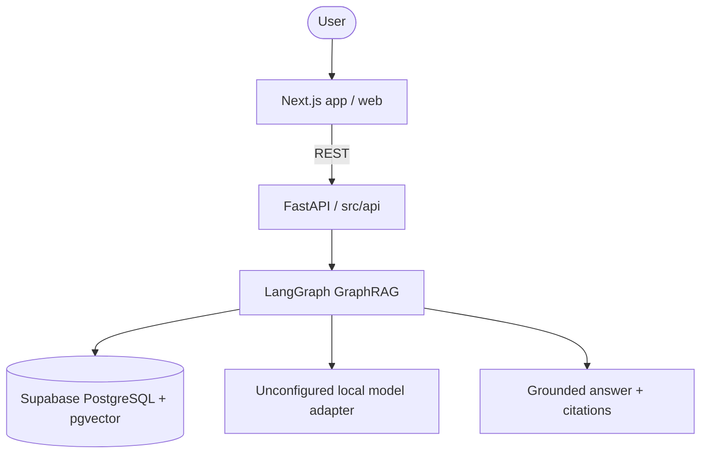
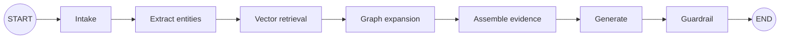

# MediPay GraphRAG Architecture

## System Overview

## Agent Flow

## Components

| Component | Technology | Purpose |
|-----------|-----------|---------|
| Frontend | Next.js in `web/` | Future user interface |
| Backend | FastAPI in `src/` | API and application services |
| Agent | LangGraph | GraphRAG orchestration |
| Database | Supabase PostgreSQL | Shared relational persistence |
| Vector | PostgreSQL `pgvector` | Semantic chunk retrieval |
| Graph | PostgreSQL entity/relation tables | Graph neighborhood retrieval |
| Models | Provider-neutral adapters | Local LLM/embedding decision pending |

Schema SQL lives in `supabase/migrations/0001_initial_graphrag.sql`. Docker runs backend only and connects to Supabase.
