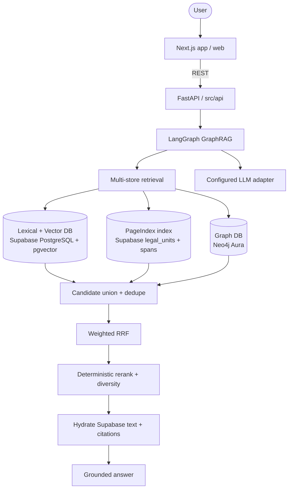
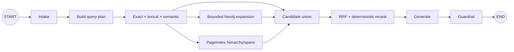

# MediPay GraphRAG Architecture

## System Overview

## Agent Flow

## Components

| Component | Technology | Purpose |
|-----------|-----------|---------|
| Frontend | Next.js in `web/` | Future user interface |
| Backend | FastAPI in `src/` | API and application services |
| Agent | LangGraph | GraphRAG orchestration |
| Database | Supabase PostgreSQL | Documents, chunks, PageIndex, lexical and semantic indexes |
| Vector | PostgreSQL `pgvector` | Semantic chunk retrieval |
| Graph | Neo4j | Graph neighborhood retrieval |
| Models | OpenAI embeddings + configured LLM adapter | `text-embedding-3-small`, 1536 dimensions |

Schema SQL lives in `database/schema.sql`; `legal_units` is the PageIndex
structure store inside Supabase, while Neo4j stores the knowledge graph. Docker
runs backend only and connects to both services.
