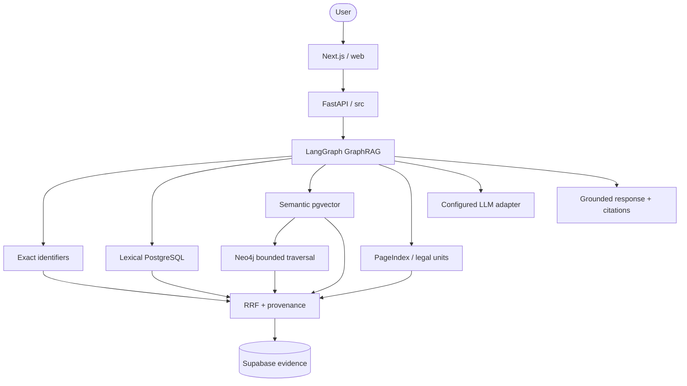

## System Architecture

## Components

### Frontend: `web/`

Next.js App Router frontend. Frontend chưa nằm trong scope implementation hiện tại.

### Backend: `src/`

FastAPI routes gọi services. Services gọi GraphRAG workflow. `src/db` quản lý SQLAlchemy async session và repositories. `src/agents` chỉ chứa state, nodes và tools.

### Database: Supabase PostgreSQL

Supabase là PostgreSQL managed, dùng full-text search và `pgvector` cho chunks.
`legal_units`/PageIndex giữ cấu trúc và source spans. Neo4j lưu document graph
và predicates có hướng. Schema PostgreSQL quản lý bằng SQL tại
`database/schema.sql`; không dùng SQLite hay Alembic.

### Model runtime

LLM và embedding chưa chốt. `src/integrations/llm.py` và `src/integrations/embeddings.py` định nghĩa interface để gắn model local sau.

## Data Flow

1. API nhận và validate query.
2. Tạo query plan và chạy exact/lexical/semantic retrieval.
3. Dùng PageIndex/legal units để giữ hierarchy và citation spans.
4. Neo4j mở rộng graph có giới hạn từ document seeds.
5. Context builder RRF hợp nhất evidence và provenance.
6. Model adapter tạo grounded response.
7. API trả response và citations.

## Design Decisions

| Decision | Choice | Reason |
|---|---|---|
| Framework | FastAPI | Async, auto-docs, type-safe |
| Agent | LangGraph | Stateful workflow |
| Database | Supabase PostgreSQL | Shared managed PostgreSQL |
| Vector | pgvector | Vector search cùng DB |
| Graph | Neo4j Aura/local | Directed predicates và graph traversal native |
| Frontend | Next.js trong `web/` | Tách boundary khỏi Python `src` |
| Migration | Supabase SQL | Không thêm Alembic |
