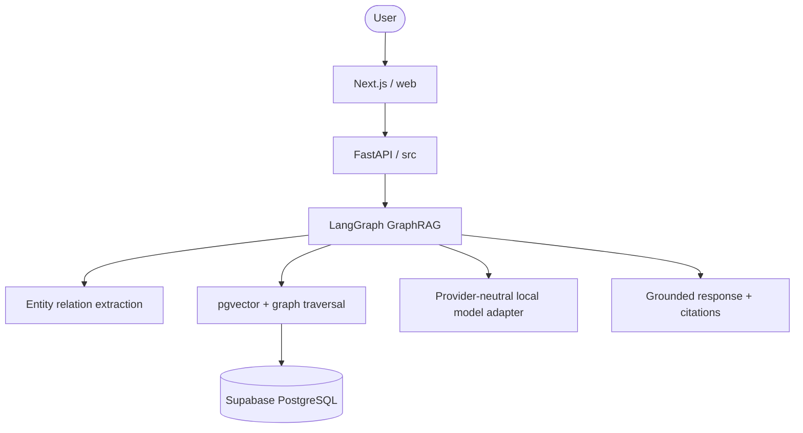

## System Architecture

## Components

### Frontend: `web/`

Next.js App Router frontend. Frontend chưa nằm trong scope implementation hiện tại.

### Backend: `src/`

FastAPI routes gọi services. Services gọi GraphRAG workflow. `src/db` quản lý SQLAlchemy async session và repositories. `src/agents` chỉ chứa state, nodes và tools.

### Database: Supabase PostgreSQL

Supabase là PostgreSQL managed, dùng `pgvector` cho chunks và bảng `entities`/`relations` cho graph. Schema quản lý bằng SQL tại `supabase/migrations`; không dùng SQLite hay Alembic.

### Model runtime

LLM và embedding chưa chốt. `src/integrations/llm.py` và `src/integrations/embeddings.py` định nghĩa interface để gắn model local sau.

## Data Flow

1. API nhận và validate query.
2. GraphLang extract entities.
3. Embedding adapter tìm chunks gần nhất khi được cấu hình.
4. Repository mở rộng graph neighbors trong Supabase.
5. Context builder hợp nhất evidence và provenance.
6. Model adapter tạo grounded response.
7. API trả response và citations.

## Design Decisions

| Decision | Choice | Reason |
|---|---|---|
| Framework | FastAPI | Async, auto-docs, type-safe |
| Agent | LangGraph | Stateful workflow |
| Database | Supabase PostgreSQL | Shared managed PostgreSQL |
| Vector | pgvector | Vector search cùng DB |
| Graph | Entity/relation tables | Đủ cho GraphRAG hiện tại |
| Frontend | Next.js trong `web/` | Tách boundary khỏi Python `src` |
| Migration | Supabase SQL | Không thêm Alembic |
